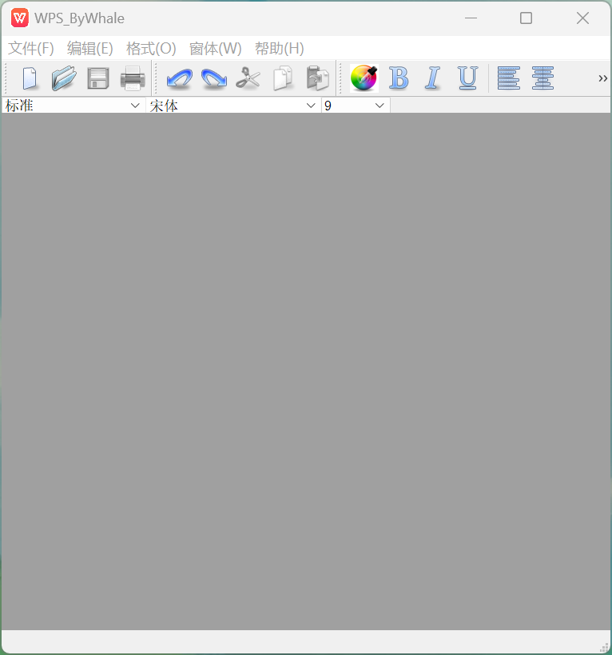
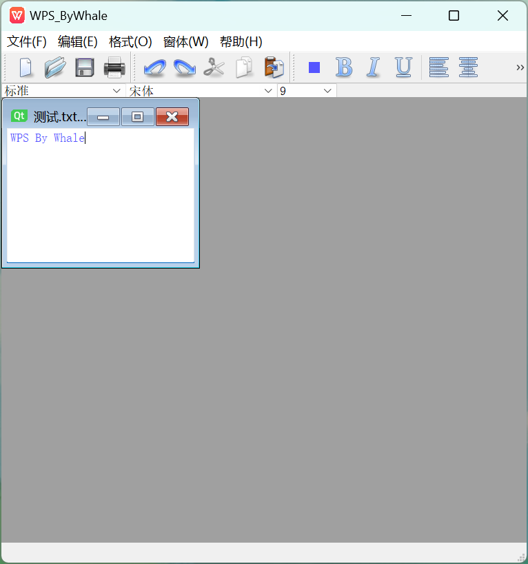

# WPS_official

基于QT框架开发一个简易的类WPS的文本处理软件，包括基本的功能，如新建/打开文本、编辑、字体/字号选择、文本对齐、加粗、斜体、打印、撤销、拷贝粘贴、颜色选择等功能，可以满足日常办公需求。

开发工具 QTCreator 、QT 5

# **软件亮点：**

- 创建/打开多个文本框时，利用QSignalMapper类创建信号映射器，实现同一种信号选择不同的子窗口。

- 利用QActionGroup类实现操作的互斥性，保文本实现对齐方式中的一种。

- 支持打开富文本和普通文本，设置默认的文本保存格式为html。

- 支持对选中的文本进行对齐、加粗、改变字体、改变颜色等功能。

- 不同的操作设置不同的快捷方式。

# **基本功能效果**

## 更多功能请自行发现......
